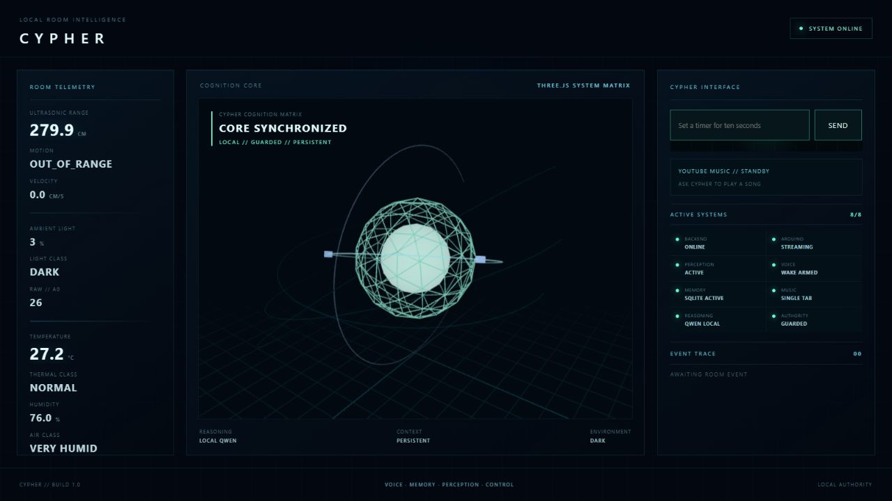

# Cypher

Cypher is an open-source, local-first physical AI desktop companion. An Arduino senses the room and controls light and sound; a Python backend turns raw readings into world state, guarded decisions, memory, alarms, and actions; and a React/Three.js HUD provides voice, text, telemetry, and music control.



## What V1 can do

- Stream ultrasonic range, ambient light, temperature, and humidity from an Arduino UNO R4 Minima.
- Detect presence, motion direction, and meaningful light changes.
- Drive a common-cathode RGB LED through semantic states and custom colors.
- Play passive-buzzer acknowledgements, alarms, and security patterns.
- Run guarded local Qwen 2.5 1.5B reasoning through Ollama with deterministic fallback.
- Listen for the **Cypher** wake word, maintain a hands-free conversation window, and speak with a fast British male system voice.
- Persist conversations, memories, timers, and alarms in SQLite.
- Answer sensor questions from live hardware and execute allowlisted physical commands.
- Challenge room entry after prolonged inactivity and trigger a local alarm on timeout.
- Resolve requested songs or a random track from a configured playlist into one HUD-owned player.
- Display telemetry, a Three.js cognition visualization, events, and subsystem status without page scrolling.

## Hardware

- Arduino UNO R4 Minima
- HC-SR04 ultrasonic sensor
- LDR and 10 kΩ resistor
- DHT11 temperature/humidity sensor
- Common-cathode RGB LED and three 220–330 Ω resistors
- Passive buzzer
- Breadboard, jumper wires, and USB cable

## Technology

| Layer | Technology |
| --- | --- |
| Firmware | Arduino C++, ArduinoJson, DHT sensor library |
| Backend | Python, FastAPI, Uvicorn, PySerial, WebSockets |
| Local AI | Ollama, Qwen 2.5 1.5B, schema validation, guard and authority policy |
| Persistence | SQLite |
| Frontend | React 19, TypeScript, Vite, Three.js, React Three Fiber |
| Voice | Browser SpeechRecognition and SpeechSynthesis |
| Music | yt-dlp metadata resolution and a single YouTube player |
| Tests | pytest, TypeScript compiler, ESLint, Vite build |

## Architecture

```text
Sensors → Arduino → serial JSON → WorldState → EventEngine
                                              ↓
                 deterministic intelligence ←┼→ guarded local Qwen
                                              ↓
                             BehaviorEngine → ActionEngine → Arduino

Voice/text → ConversationAgent → allowlisted tools → SQLite / sensors / actions
FastAPI WebSocket → React + Three.js HUD
```

The LLM never writes pins or arbitrary serial commands. Structured decisions pass through schema validation, a semantic guard, and a narrow authority policy. Invalid or unavailable AI falls back to deterministic behavior.

## Documentation

- [Set up and run Cypher](docs/SETUP.md)
- [Build Cypher from scratch](docs/BUILD_FROM_SCRATCH.md)
- [Circuit diagram and wiring reference](docs/CIRCUIT.md)

## Quick start

After completing the [setup guide](docs/SETUP.md), use three PowerShell terminals:

```powershell
ollama serve
```

```powershell
Set-Location E:\cypher
.\.venv\Scripts\Activate.ps1
$env:CYPHER_TIMEZONE="Asia/Kolkata"
python -m uvicorn backend.app:app --host 127.0.0.1 --port 8000
```

```powershell
Set-Location E:\cypher\frontend
npm run dev -- --host 127.0.0.1
```

Open `http://127.0.0.1:5173/` in Chrome or Edge and allow microphone access.

## Example commands

- “Cypher, what is the temperature?”
- “Set the lights to yellow.”
- “Set a timer for thirty seconds.”
- “Set an alarm for 6 AM.”
- “What time is it?”
- “Remember that I prefer concise answers.”
- “What do you remember?”
- “Play Midnight City.”
- “Play my playlist.”
- “Stop the music.”
- “Silence the buzzer.”

## Project status

This repository represents the **Cypher V1** checkpoint. It is an experimental project, not a certified security or life-safety device. Ultrasonic presence detection cannot identify a person, and browser voice/music behavior depends on browser and provider support.

## Contributing

Issues and pull requests are welcome. Keep hardware effects behind the behavior/action boundary, add tests for new tools and policies, and never commit credentials, databases, or personal conversation data.

## License

[MIT](LICENSE)
