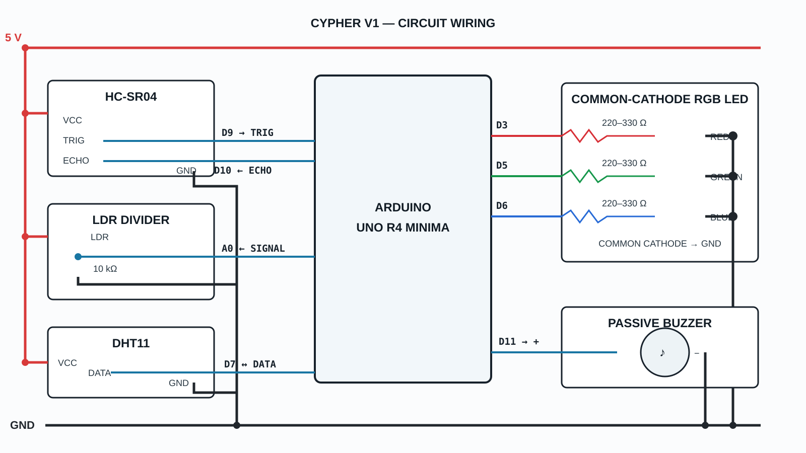

# Cypher V1 circuit and wiring

The diagram is an AI-assisted technical illustration redrawn against firmware constants. The tables are authoritative.



## Signal wiring

| Arduino | Component | Notes |
| --- | --- | --- |
| D9 | HC-SR04 TRIG | Output |
| D10 | HC-SR04 ECHO | Input |
| A0 | LDR divider midpoint | Analog input |
| D7 | DHT11 DATA | Bare sensors may require a pull-up |
| D3 | 220–330 Ω → RGB red anode | PWM |
| D5 | 220–330 Ω → RGB green anode | PWM |
| D6 | 220–330 Ω → RGB blue anode | PWM |
| D11 | Passive buzzer positive | Tone output |

## Power

| Rail | Connections |
| --- | --- |
| 5 V | HC-SR04 VCC, DHT11 VCC, top of LDR divider |
| GND | HC-SR04 GND, DHT11 GND, divider bottom, RGB common cathode, buzzer negative |

All modules share ground. Never connect an RGB channel directly without its own resistor.

## LDR divider

```text
5 V ── LDR ──┬── A0
             │
            10 kΩ
             │
            GND
```

## Common-cathode RGB LED

```text
D3 ── 220–330 Ω ── RED anode
D5 ── 220–330 Ω ── GREEN anode
D6 ── 220–330 Ω ── BLUE anode
common cathode ───── GND
```

Lead order varies. Use the component datasheet rather than assuming physical order.

## Passive buzzer

```text
D11 ── buzzer +
GND ── buzzer -
```

V1 drives a small passive buzzer for short tones. Use a transistor driver for a higher-current sounder.

## Pre-power checklist

- Confirm common-cathode RGB.
- Confirm one resistor per color channel.
- Confirm shared ground.
- Confirm no 5 V connection to an output pin.
- Confirm TRIG D9 and ECHO D10.
- Confirm passive buzzer on D11.
